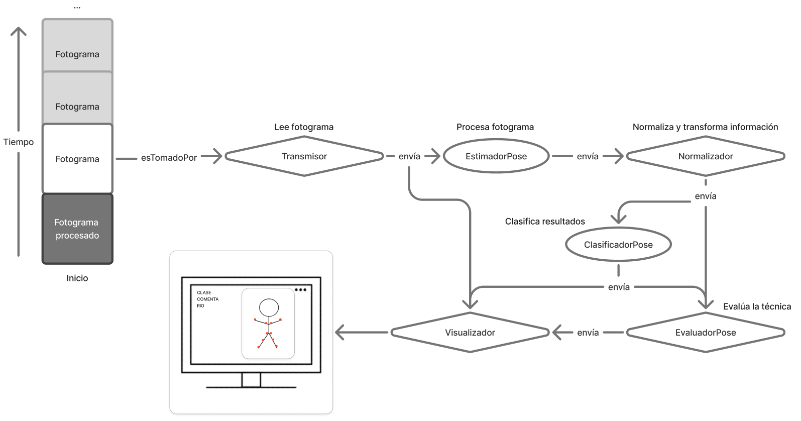

# bodyweight-exercise-pose-estimation

## Abstract

The project involves the development of a system for correcting bodyweight exercises. This system is capable of recognising push-ups and squats and distinguishing these movements from typical actions in a sports setting.

The aim behind building the prototype is to provide a sports tool that end-users can rely on for their training sessions. This is particularly useful in helping novice athletes maintain correct technique through visual feedback on the screen.
For its development, a methodology based on experimentation was followed, allowing for methodological and conceptual errors to refine the system.

The result is a basic, functional application for the automatic detection and correction of bodyweight squats and push-ups. This application can be improved in the future by adding, amongst other features, a graphical interface, a greater variety of exercises, or enhanced accuracy and user feedback.

This project has enabled the development of software from the ground up. During this process, a real-world need was identified, solutions were proposed, and data mining and artificial intelligence model training techniques were studied and implemented, achieving an adequate and functional result within a reasonable timeframe.

## Arquitecture

## Enviroment creation

conda env create -f environment.yml

## How to use

With the github project downloaded and having models\mediapipe\pose_landmarker_heavy.task, models\rf_classifier\rf_model.joblib and folder src:

    python -m src.main

To finalize the program just press "q".

## Theorical Aspects

### PoseVisualizer

For mediapipe:

$x_{\text{px}}, y_{\text{px}}$
$$x_{\text{pixel}} = \text{int}(x_{\text{normalized}} \cdot \text{image\_width})$$
$$y_{\text{pixel}} = \text{int}(y_{\text{normalized}} \cdot \text{image\_width})$$

### Precision metrics

Object Keypoint Similarity (OKS):

It penalizes the error, taking into account the size of the person in the image and how "difficult" it is to label each specific joint.

$$OKS = \frac{\sum_i \exp(\frac{-d_i^2}{2s^2k_i^2}) \delta(v_i > 0)}{\sum_i \delta(v_i > 0)}$$

$d_i$: This is the Euclidean distance between the predicted point ($x_p, y_p$) and the actual point ($x_g, y_g$). It is calculated as: $\sqrt{(x_p-x_g)^2 + (y_p-y_g)^2}$. 

$s$: This is the person's scale. It is usually defined as the square root of the area of ​​the bordering box ($s = \sqrt{width \times height}$). 

$k_i$: Constant per joint that controls the exponential fall (the variation of human scorers). $k_i = σ_i^2=E[\frac{d_i^2}{s^2}]$

$v_i$: This is the visibility of the point in the Ground Truth ($v=0$: unlabeled, $v=1$: occluded, $v=2$: visible). The function $\delta(v_i > 0)$ simply indicates that we only sum the points that exist in the actual dataset.

$\delta()$: Function that equals 1 if the condition is true, 0 if not.

For more information visit the coco dataset web: https://cocodataset.org/#keypoints-eval.

Percentage of correct key points (PCK):

PCK measures the percentage of key points that the model has predicted "correctly." A point is considered correct if the difference between the prediction and the actual value is below a specific threshold.

$$PCK = \frac{1}{N} \sum_{i=1}^{N} \delta \left( \frac{d_i}{d_{norm}} \le T \right)$$

$N$: Total number of key points (in your case, 12).

$\mathbf{p}_i$: Coordinates $(x, y)$ of the predicted point.

$\mathbf{g}_i$: Coordinates $(x, y)$ of the actual point (Ground Truth).

$d_i$: : Euclidean distance. 

$d_{norm}$: Normalization distance (e.g., size of the diagonal bounding box, or distance from the shoulder to the opposite hip).

$T$: Tolerance threshold (e.g., $0.2$, which means 20% of $d_{norm}$).

### Hardware metrics

#### Processing Performance

* **Inference Latency**: This is the exact time it takes the neural network to perform mathematical calculations.

* **FPS (Frames Per Second)**: Complete cycles (End-to-End Latency) your computer can do in exactly one second.

#### Resource Consumption

* **CPU Usage (%)**: How much of the main processor's capacity is being used.

* **GPU Usage (%)**: How much of the GPU processor's capacity is being used.

* **RAM Usage (MB/GB)**: How much system memory the script allocates while running.

* **VRAM Usage (MB/GB)**: Video memory used if running on the GPU.

### Phase 2

#### Angle Calculation

**Joint Vector:**
Vector Vertex B to Joint A: $\vec{BA} = A - B = (x_A - x_B, y_A - y_B, z_A - z_B)$
Vector Vertex B to Joint c: $\vec{BC} = C - B = (x_C - x_B, y_C - y_B, z_C - z_B)$

**Scalar product:**

$$\vec{BA} \cdot \vec{BC} = |\vec{BA}| |\vec{BC}| \cos(\theta)$$

**Angle between vectors:**

$$\theta = \arccos \left( \frac{\vec{BA} \cdot \vec{BC}}{|\vec{BA}| |\vec{BC}|} \right)$$

#### Normalization (Size Invariance)

**Shoulder Mid Point:**

$$Midshoulder_x = \frac{LeftShoulder_x + RightShoulder_x}{2}$$
$$Midshoulder_y = \frac{LeftShoulder_y + RightShoulder_y}{2}$$
$$Midshoulder_z = \frac{LeftShoulder_z + RightShoulder_z}{2}$$

**ShoulderMid-HipMid distance:**

$$L_{torso} = \sqrt{(Midshoulder_x - MidHip_x)^2 + (Midshoulder_y - MidHip_y)^2 + (Midshoulder_z - MidHip_z)^2}$$

**Normalización by Keypoint i:**
$$x''_{i} = \frac{x'_i}{L_{torso}}$$

**Smoothing:**
$$EMA_t = \alpha \cdot x_t + (1 - \alpha) \cdot EMA_{t-1}$$

$EMA_t$: This is the clean prediction or smoothed position in the current frame.
$x_t$: This is the raw, noisy measurement just given to you by the camera in this frame.
$EMA_{t-1}$: This is the smoothed value you calculated in the previous frame (this is where the filter's "memory" resides).
$\alpha$ (Alpha): This is the "Smoothing Factor," a number between 0 and 1. It's the heart of the algorithm.

** This documentation is not fully completed but is the basics to understand the fundamentals behind the code. **

** Please, if you have doubts or any sugestion you can contact me througth [Linkedin](www.linkedin.com/in/miguel-ángel-lópez) **
